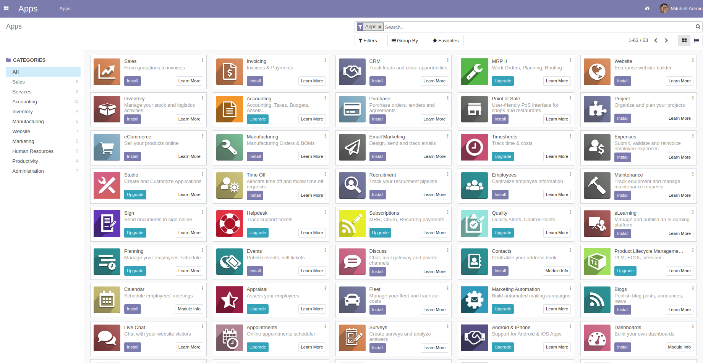
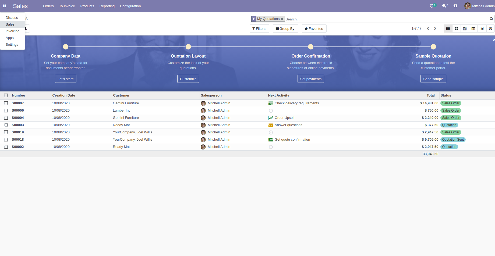
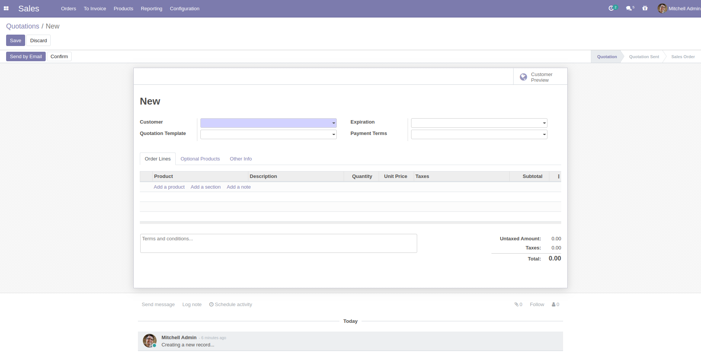

# Installing Odoo 14 with one command

(Supports multiple Odoo instances on one server)

Install [docker](https://docs.docker.com/get-docker/) and [docker-compose](https://docs.docker.com/compose/install/) yourself, then run:

``` bash
# 1st Odoo @ localhost:10014
$ curl -s https://raw.githubusercontent.com/minhng92/odoo-14-docker-compose/master/run.sh | sudo bash -s odoo-14-docker-compose-one 10014

# 2nd Odoo @ localhost:11014
$ curl -s https://raw.githubusercontent.com/minhng92/odoo-14-docker-compose/master/run.sh | sudo bash -s odoo-14-docker-compose-two 11014
```

Some arguments:
* First argument (**odoo-14-docker-compose-one**): Odoo deploy folder
* Second argument (**10014**): Odoo port

If `curl` is not found, install it:

``` bash
$ sudo apt-get install curl
# or
$ sudo yum install curl
```

# Usage

Change the folder permission to make sure that the container is able to access the directory:

``` sh
$ sudo chmod -R 777 addons
$ sudo chmod -R 777 etc
$ mkdir -p postgresql
$ sudo chmod -R 777 postgresql
```

Increase maximum number of files watching from 8192 (default) to **524288**. In order to avoid error when we run multiple Odoo instances. This is an *optional step*:

```
$ if grep -qF "fs.inotify.max_user_watches" /etc/sysctl.conf; then echo $(grep -F "fs.inotify.max_user_watches" /etc/sysctl.conf); else echo "fs.inotify.max_user_watches = 524288" | sudo tee -a /etc/sysctl.conf; fi
$ sudo sysctl -p    # apply new config immediately
```

Start the container:
``` sh
$ docker-compose up
```

* Then open `localhost:10014` to access Odoo 14.0. If you want to start the server with a different port, change **10014** to another value in **docker-compose.yml**:

```
ports:
 - "10014:8069"
```

* Log file is printed @ **etc/odoo-server.log**

Run Odoo container in detached mode (be able to close terminal without stopping Odoo):

```
$ docker-compose up -d
```

# Custom addons

The **addons/** folder contains custom addons. Just put your custom addons if you have any.

# Odoo configuration & log

* To change Odoo configuration, edit file: **etc/odoo.conf**.
* Log file: **etc/odoo-server.log**

``` conf
[options]
addons_path = /mnt/extra-addons
data_dir = /etc/odoo
logfile = /etc/odoo/odoo-server.log
admin_passwd = minhng.info
```

* Default database password (**admin_passwd**) is `minhng.info`, please change it!

# Odoo container management

**Restart Odoo**:

``` bash
$ docker-compose restart
```

**Kill Odoo**:

``` bash
$ docker-compose down
```

# Remove Odoo & data

Completely remove Odoo and all databases!

``` sh
$ sh remove_odoo.sh
```

# docker-compose.yml

* odoo:14.0
* postgres:13

# Odoo 14 screenshots






